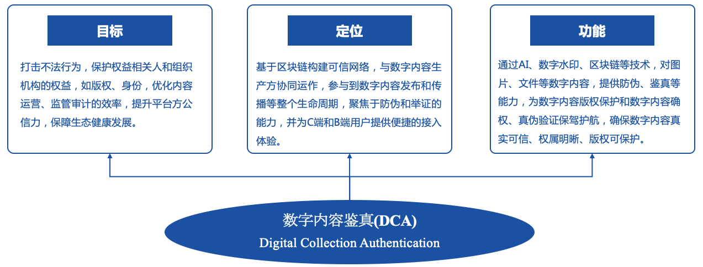
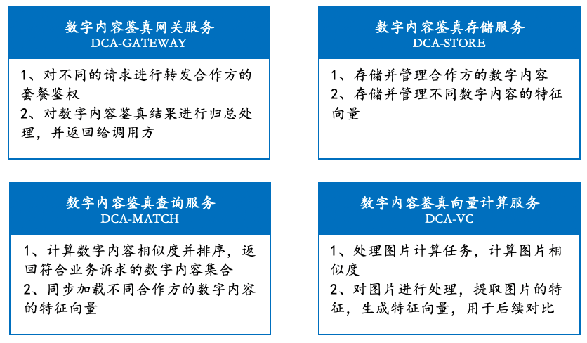

# 背景介绍

针对数字内容冒用、剽窃、恶意模仿、抄袭等问题，我们开发数字内容鉴真解决方案 WeBankBlockchain-DCA(Digital Collection Authentication)。

# WeBankBlockchain-DCA 简介

WeBankBlockchain-DCA 基于区块链构建可信网络、数字水印和 AI 能力，与数字内容平台协同运作，参与到数字内容的发布和流转等整个生命周期，聚焦于防伪和举证的能力，并为 C 端和 B 端用户提供便捷的接入体验。

# 模块功能介绍

WeBankBlockchain-DCA 项目后端服务，包括 4 个服务子系统：网关服务、存储服务、图片查询服务、向量计算服务。

- [网关服务（WeBankBlockchain-DCA-GATEWAY）](https://github.com/WeBankBlockchain/DCA-GATEWAY)
- [存储服务（WeBankBlockchain-DCA-STORE）](https://github.com/WeBankBlockchain/DCA-STORE)
- [图片查询服务（WeBankBlockchain-DCA-MATCH）](https://github.com/WeBankBlockchain/DCA-MATCH)
- [向量计算服务（WeBankBlockchain-DCA-VC）](https://github.com/WeBankBlockchain/DCA-VC)

# 贡献代码

欢迎参与本项目的社区建设：

- 如项目对您有帮助，欢迎点亮我们的小星星(点击项目右上方 Star 按钮)。
- 欢迎提交代码(Pull requests)。
- [提问和提交 BUG](https://github.com/WeBankBlockchain/DCA/issues)。
- 如果发现代码存在安全漏洞，请在[这里](https://security.webank.com)上报。

# License

开源协议为[Apache License 2.0](http://www.apache.org/licenses/). 详情参考[LICENSE](../LICENSE)。
